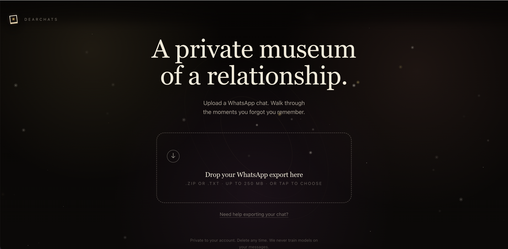

<div align="center">

# DearChats

**Turn years of exported WhatsApp conversations into a beautiful, interactive memory experience.**

DearChats reads a chat export and rebuilds it as a private 3D universe of curated moments — drifting photos, ambient music, and a quiet narrator that points at the things you'd otherwise forget. The ordinary messages that become precious years later.



</div>

---

## Try it

The easiest way to experience DearChats is the hosted version — no setup required:

### 👉 [dearchats.opxia.com](https://dearchats.opxia.com/)

Sign in with Google, upload a WhatsApp export, and start exploring for free.

---

## What you get

- **3D constellation** — your relationship as a universe of mood-colored stars, each a curated moment.
- **Year navigation** — drill into any year as a 12-month mini-constellation with per-month photo decks.
- **Reader Mode** — a memoir-style scroll for those who'd rather read (also the fallback when WebGL is unavailable).
- **Private Dictionary** — your nicknames, rituals, inside jokes, and recurring phrases, with first/last-used dates.
- **Memory Film** — a short, shareable 9:16 video cut from the emotional arc of the whole chat.
- **A restrained narrator** — prose that earns emotion through specifics, never adjectives.

---

## How it works

```
WhatsApp export (.zip / .txt)
        │
        ▼
Parse + segment  →  AI curation pipeline  →  3D universe + reader + film
```

DearChats runs a multi-stage AI pipeline: it triages messages, maps the relationship into chapters, extracts recurring patterns, curates the most meaningful moments per year, and writes all the on-screen prose in a single consistent voice. Photos are classified to prefer real shared moments over screenshots.

**Built with:** Next.js 15 (App Router) · React 19 · TypeScript · Tailwind · `three` / react-three-fiber · OpenAI · SQLite (`better-sqlite3`) · `ffmpeg` + `@napi-rs/canvas` for video.

---

## Run it locally

### Prerequisites

- **Node.js 20+**
- **ffmpeg** on your `PATH` (only needed for the Memory Film feature)
- An **OpenAI API key**
- **Google OAuth credentials** (sign-in is Google-only)

### 1. Install

```bash
git clone https://github.com/opxiahub/dearchats.git
cd dearchats
npm install
```

### 2. Configure environment

```bash
cp .env.example .env.local
```

Fill in `.env.local`:

| Variable | Required | Notes |
|---|---|---|
| `OPENAI_API_KEY` | ✅ | Powers the curation pipeline |
| `GOOGLE_CLIENT_ID` | ✅ | From the Google Cloud Console |
| `GOOGLE_CLIENT_SECRET` | ✅ | From the Google Cloud Console |
| `GOOGLE_CALLBACK_URL` | ✅ | `http://localhost:3000/api/auth/google/callback` for local |
| `OPENAI_MAIN_MODEL` / `OPENAI_MINI_MODEL` / `OPENAI_VISION_MODEL` | optional | Override the default models |
| `NEXT_PUBLIC_MAX_UPLOAD_MB` | optional | Max upload size in MB (defaults to `250`) |

> **Google OAuth setup:** create OAuth credentials in the [Google Cloud Console](https://console.cloud.google.com/apis/credentials) and add `http://localhost:3000/api/auth/google/callback` as an Authorized redirect URI.

### 3. Run

```bash
npm run dev
```

Open [http://localhost:3000](http://localhost:3000).

### Available scripts

| Command | Description |
|---|---|
| `npm run dev` | Start the dev server |
| `npm run build` | Production build |
| `npm start` | Run the production build |
| `npm run typecheck` | Type-check with `tsc` |

Data is stored locally in `.data/` (SQLite database + uploaded media + rendered films). It is gitignored and never leaves your machine.

### Docker

A `Dockerfile` is included (it installs `ffmpeg` and bundles the native dependencies). Build and run it with your environment variables supplied at runtime.

---

## Privacy

Your conversations are personal. When self-hosted, everything stays on your own infrastructure — chat exports, media, and generated content live in the local `.data/` directory and are only sent to the OpenAI API for curation. Nothing is shared publicly.

---

## License

[MIT](LICENSE) © Opxia
